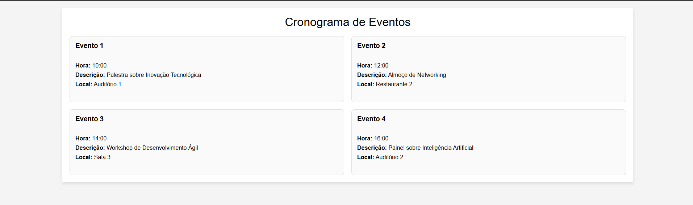

# Atividade - Etapa 3: Estruturação com divs e CSS

Especializando ainda mais o que estamos aprendendo, nesta tarefa vocês irão dar continuidade ao que foi explorado na etapa anterior: a criação de um cronograma! No entanto, agora será necessário refazê-lo utilizando os conceitos ensinados nesta etapa, substituindo o uso de **tables**, como feito anteriormente.

Dessa vez, o mesmo cronograma deverá ser recriado utilizando práticas como **divs** e conceitos como **display flex** e **grid**. Para a entrega desta atividade, vocês deverão utilizar o **GitHub Classroom**, assim como nas etapas anteriores.

## Habilidades a Serem Desenvolvidas

Nesta atividade, trabalharemos o desenvolvimento das seguintes habilidades:

- **HTML**: Estruturação com divisões (divs) e frames
- **CSS**: Estilização com Display Flex e Grid

## Atividade Prática

Nesta tarefa, vocês irão utilizar a tabela criada na etapa anterior como base para aprofundar seus conhecimentos em HTML e CSS. O objetivo agora é refazer o cronograma utilizando os novos conceitos aprendidos, **sem o uso de tabelas**.

📌 **Importante**: O cronograma abaixo deve ser recriado exclusivamente com **divs** e **CSS**, sem utilizar nenhuma tag de tabela.



Utilizando os conceitos abordados, desenvolvam essa tabela de forma que atenda aos requisitos propostos, garantindo uma boa visualização dos eventos, com destaque para horários simultâneos e informações específicas. Após finalizar o código, enviem-no pelo link do **GitHub Classroom**.

## Ferramentas Utilizadas

- **HTML**: Estruturação da tarefa
- **CSS**: Estilização e disposição dos dispositivos
- **GitHub, GitHub Classroom e GitHub Codespace**: Local onde o código será armazenado e corrigido pela equipe

## Critérios de Avaliação

A entrega será validada pelo **GitHub Classroom**, garantindo que todas as etapas tenham sido concluídas corretamente. Os seguintes aspectos serão avaliados:

- ✅ **Arquivo com extensão ".html"** presente;
- ✅ **Arquivo com extensão ".css"** presente;
- ✅ **Uso correto das tags**: "div", "ul", "li";
- ✅ **Estilização feita usando conceitos como "Display Flex" e "Grid";

## Como Usar as Divs e Estilizações em CSS

### 1. **Tag `<div>`**

A tag `<div>` é usada para criar uma divisão de conteúdo. Ela serve como um recipiente para agrupar outros elementos, sendo útil para organização e layout de página. Exemplo:

```html
<div class="evento">
  <p>Evento 1</p>
  <p>10:00</p>
</div>
```

### 2. **Display Flex**

O **display flex** é um método para criar layouts de forma flexível. Ele permite que os elementos dentro de um contêiner sejam alinhados e distribuídos de maneira eficiente. Exemplo de uso:

```css
.container {
  display: flex;
  justify-content: space-between;
}
```

No exemplo acima, o conteúdo dentro do contêiner será distribuído igualmente, com espaço entre os elementos.

### 3. **Display Grid**

O **display grid** é um sistema de layout baseado em grades. Ele permite dividir a página em colunas e linhas, proporcionando controle preciso sobre a distribuição do conteúdo. Exemplo de uso:

```css
.container {
  display: grid;
  grid-template-columns: repeat(3, 1fr);
}
```

Neste exemplo, o contêiner é dividido em três colunas de largura igual.

### 4. **Listas (ul, li)**

As tags `<ul>` e `<li>` são usadas para criar listas não ordenadas. Elas podem ser usadas para organizar itens dentro de uma estrutura de cronograma. Exemplo:

```html
<ul class="cronograma">
  <li>Evento 1 - 10:00</li>
  <li>Evento 2 - 11:00</li>
</ul>
```

No exemplo acima, cada item do cronograma é uma lista não ordenada dentro da estrutura `ul`.

---

Boa sorte e aproveite a experiência de aprofundar seu conhecimento em HTML e CSS! 🚀
